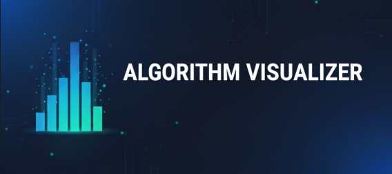

# Algorithm Visualizer 😎✨✨



Minimal , extensible Python Algorithm Visualizer with small demos and a Streamlit web UI.

This repository contains simple algorithm implementations (sorting, search, pathfinding) plus small visualizers and example scripts you can run locally. It's designed for **learning, teaching, and experimentation**, now celebrating **Hacktoberfest 2025!** 🎉


---

## Features 🚀

- Lightweight algorithm implementations with generator-based frame output for visualization.
- Streamlit-based web demo (`web_app.py`) for interactive playback.
- Example CLI/demo scripts under `examples/`.
- Small test suite for core algorithms.
- Beginner-friendly and Hacktoberfest ready! 🎃

---

## Requirements 🛠️

- Python 3.8+
- See `requirements.txt` (recommended: virtualenv)

---

## Quick Start ⚡

### Create and activate a virtualenv:

```bash
python -m venv .venv
# Windows
.\.venv\Scripts\Activate.ps1
# macOS/Linux
source .venv/bin/activate
```

### Install dependencies:

```bash
pip install -r requirements.txt
```

### Run Streamlit visualizer:

```bash
streamlit run web_app.py
```

- Sidebar options:
  - Select an algorithm (Bubble Sort, Insertion Sort, Selection Sort, Binary Search)
  - Enter an array (e.g., `5,2,4,1,3`)
  - Generate frames, use Play / Pause / Step controls
  - Adjust playback speed (multiplier persists across runs)

### Run CLI demo (non-Streamlit):

```bash
python examples/run_sort_demo.py
```

> 💡 _Optional:_ Add an image of your web UI here to show off your Streamlit interface!

---

## Algorithms Included 📚

- **Sorting:**
  - `bubble_sort` — stable O(n²), generator frames for visualization.
  - `insertion_sort` — simple O(n²), generator frames.
  - `selection_sort` — O(n²), selection-based.
- **Searching:**
  - `binary_search` — generator-based, shows current range and highlight.
- **Pathfinding:**
  - `bfs_pathfinding` — BFS demo for grid/path visualizations.

---

## Project Layout 🗂️

- `web_app.py` — Streamlit UI logic
- `algorithms/` — generator-based algorithm implementations
- `visualizers/` — helper visualizers
- `examples/` — demo scripts
- `tests/` — unit tests
- `docs/roadmap.md` — contribution guide & roadmap

---

## Development Notes 🧩

Each algorithm yields frames as dictionaries:

```python
{
    'state': [5, 2, 4, 1, 3],
    'highlight': (i, j),  # indices to highlight
    'info': 'Comparing index i and j',
}
```

Streamlit (`web_app.py`) renders these frames as bar charts. Playback speed uses `st.session_state.multiplier`.

---

## Testing ✅

```bash
python -m pytest -q
```

---

## Contributing 🤝

- Read `docs/roadmap.md` for guidelines.
- To add an algorithm:
  1. Add implementation under `algorithms/` (yield frames like existing ones).
  2. Add a unit test under `tests/` and update `visualizers/` if needed.
  3. Open a PR with descriptive title and test coverage.

> Hacktoberfest 2025 participants are welcome! 🎃

---

## License 📜

This project is open source. See `LICENSE` for details.

---

## Contact / Questions ✉️

- Open an issue or PR if you want help adding an algorithm or improving the UI.

Enjoy exploring algorithms! 🚀
